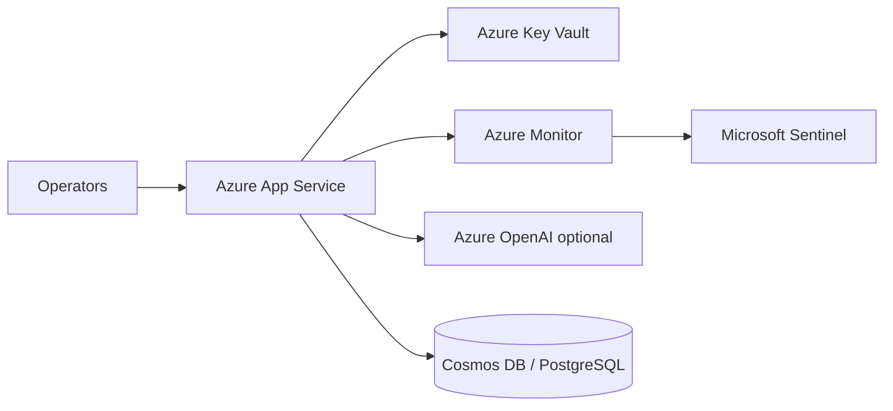

# SentinelOps AI

**Multi-Agent Cloud Incident Response & Compliance Orchestration Platform**

SentinelOps AI is an MVP Streamlit application that simulates an enterprise Security Operations Center (SOC) workflow. Seven specialized agents analyze cloud incidents using mock telemetry, enforce compliance guardrails, and produce auditable remediation plans—without requiring API keys for local demos.


<!-- Add screenshot: streamlit run app.py → Dashboard after preset run -->

---

## Overview

Operators describe a cloud incident in natural language. The platform routes the request through intake, planning, parallel log/compliance/RCA analysis, remediation, and final audit—producing severity classification, evidence, root cause, compliance status, remediation steps, risk/confidence scores, and a full audit trail.

**Key capabilities:**

- 7-agent orchestrated workflow (custom Python orchestrator)
- Deterministic mock AI when no LLM keys are configured
- Optional Groq / OpenAI integration via environment variables
- Guardrails block unsafe instructions (prompt injection, policy bypass, destructive actions)
- 5 preset scenarios including a guardrail test case

---

## Architecture

```
User Input → IntakeAgent → PlannerAgent
                ↓
    ┌───────────┼───────────┐
    ↓           ↓           ↓
LogAnalysis  Compliance  RootCause
    └───────────┼───────────┘
                ↓
        RemediationAgent (if compliant)
                ↓
           AuditorAgent → Final Report
```

See [docs/architecture_summary.md](docs/architecture_summary.md) for detailed design notes.

---

## Agents

| Agent | Responsibility |
|-------|----------------|
| **IntakeAgent** | Intent, entities, affected services, severity |
| **PlannerAgent** | Task list and execution order |
| **LogAnalysisAgent** | CSV log analysis, anomalies, evidence |
| **RootCauseAgent** | RCA from correlated evidence |
| **ComplianceAgent** | Policy checks, prompt injection detection |
| **RemediationAgent** | Safe actions with approval flags |
| **AuditorAgent** | Risk/confidence scores, executive summary |

---

## Guardrails

`utils/guardrails.py` blocks phrases such as:

- ignore previous instructions / ignore compliance rules
- bypass policy, disable logging, disable authentication
- reveal secrets, expose customer PII
- delete production database, escalate privileges

When triggered, the workflow stops with `blocked` status, no remediation, and an audit log entry.

---

## Tech Stack

- **UI:** Streamlit (enterprise dark theme)
- **Data:** Pandas, in-memory CSV/JSON
- **Orchestration:** Custom `SentinelOrchestrator` (no external graph runtime required)
- **LLM (optional):** Groq, OpenAI via `utils/llm_client.py`

---

## Folder Structure

```
SentinelOps AI/
├── app.py                 # Streamlit UI
├── startup.sh             # Azure App Service startup (port 8000)
├── requirements.txt
├── runtime.txt            # Python 3.11 for Azure Oryx
├── README.md
├── agents/                # Seven agents + orchestrator
├── utils/                 # guardrails, llm_client
├── data/                  # Mock logs, rules, policy
├── docs/                  # Architecture + Azure deployment
└── assets/ui_mockups/
```

---

## Setup (Local)

```bash
cd "/Users/milipatel/Desktop/SentinelOps AI"
python -m venv .venv
source .venv/bin/activate   # Windows: .venv\Scripts\activate
pip install -r requirements.txt
streamlit run app.py
```

Open `http://localhost:8501` in your browser.

### Optional LLM Keys

1. Copy the example env file in the project root:

```bash
cp .env.example .env
```

2. Open `.env` and paste your keys (never commit this file):

```env
GROQ_API_KEY=your_groq_key
OPENAI_API_KEY=your_openai_key
```

Optional model overrides:

```env
GROQ_MODEL=llama-3.3-70b-versatile
OPENAI_MODEL=gpt-4o-mini
```

3. **Restart Streamlit** after saving `.env` so keys are loaded (`Ctrl+C`, then `streamlit run app.py` again).

Priority: **Groq → OpenAI → deterministic mock**. The sidebar shows **Groq connected**, **OpenAI connected**, or **Mock mode active**.

> **Prototype note:** This repository uses **local mock CSV/JSON data** under `data/`. No live Azure Monitor or database connectors are wired in the MVP.

---

## Deploy to Streamlit Community Cloud

1. Push this repository to GitHub (root = `app.py`).
2. Go to [share.streamlit.io](https://share.streamlit.io) and connect the repo.
3. Set **Main file path** to `app.py`.
4. (Optional) Add secrets in the Cloud dashboard for `GROQ_API_KEY` / `OPENAI_API_KEY`.
5. Deploy.

No Docker or cloud infrastructure required.

---

## Deploy to Azure App Service

Host the same Streamlit app on **Azure App Service (Linux)** without Docker.

| Item | Value |
|------|--------|
| Entry point | `app.py` (unchanged) |
| Startup | `bash startup.sh` |
| Port | **8000** — set App Service **WEBSITES_PORT** = `8000` |
| Python | 3.11 (`runtime.txt`) |

**Quick steps**

1. Create a **Linux** App Service with **Python 3.11**.  
2. Set **Startup Command** to `bash startup.sh` and **WEBSITES_PORT** to `8000`.  
3. Deploy the repo (ZIP, GitHub, or local Git)—exclude `venv/` and `.env`.  
4. Add API keys under **Configuration → Application settings** (see below).

Full walkthrough: **[docs/azure_deployment_guide.md](docs/azure_deployment_guide.md)**

### API keys on Azure

In the Azure Portal: **App Service → Configuration → Application settings**

| Setting | Purpose |
|---------|---------|
| `GROQ_API_KEY` | Optional — enables Groq (preferred) |
| `OPENAI_API_KEY` | Optional — fallback LLM |
| `GROQ_MODEL` / `OPENAI_MODEL` | Optional model overrides |

Save and restart the app. Keys are read via `os.getenv()` in `utils/llm_client.py` (no `.env` file required in Azure).

For production, use **Azure Key Vault references** in Application settings instead of plain-text secrets (see the deployment guide).

### Production Azure architecture (conceptual)

For assignment or stakeholder presentations, a full production footprint could look like this:



| Service | Role |
|---------|------|
| **Azure App Service** | Hosts the Streamlit SentinelOps UI and orchestrator |
| **Azure Key Vault** | Stores `GROQ_API_KEY`, `OPENAI_API_KEY`, and other secrets |
| **Azure Monitor** | Metrics, logs, and alerting for the web app |
| **Microsoft Sentinel** | SIEM — security events and incident correlation |
| **Azure OpenAI** | Enterprise-managed LLM option (alternative to Groq/public OpenAI) |
| **Cosmos DB / PostgreSQL** | Persistent incident history and audit logs |

The **current repo** remains a **prototype**: mock telemetry in `data/`, no Key Vault or database integration in code.

---

## Example Scenarios

| Preset | Expected outcome |
|--------|------------------|
| Payment API latency + failed logins | Cross-service RCA, medium-high risk |
| Database CPU + checkout failures | DB pool exhaustion RCA |
| Suspicious privilege escalation | Security-focused remediation with approvals |
| Auth outage after deployment | Post-deploy rollback recommendation |
| Unsafe: delete production DB | **Guardrail block** — no remediation |

---

## Future Improvements

- LangGraph state machine with checkpointing
- Azure Monitor / Log Analytics connectors
- RBAC and SSO for operator roles
- Persistent incident store (Cosmos DB / PostgreSQL)
- Real-time WebSocket alert ingestion
- Automated ticket creation (ServiceNow / Jira)

---

## Screenshot Placeholders

1. `assets/ui_mockups/dashboard.png` — Main intake + metrics
2. `assets/ui_mockups/workflow.png` — Agent cards
3. `assets/ui_mockups/blocked.png` — Guardrail block scenario

---

## License

MVP for Junior Forward Deployed Engineer pre-screening assignment.
