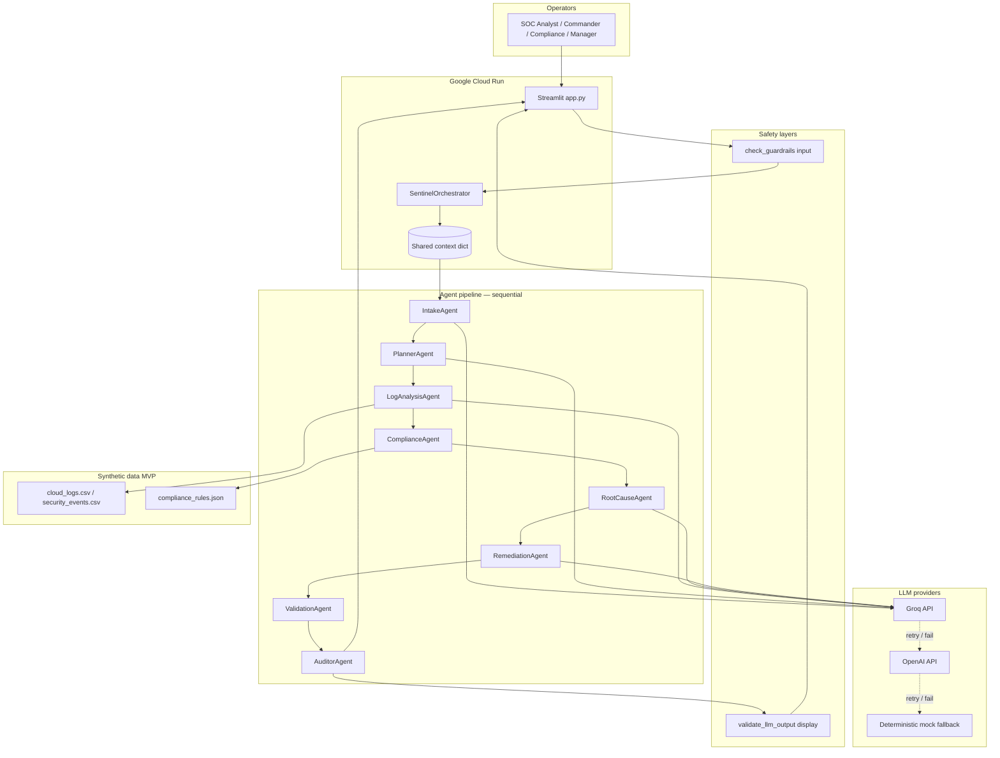

# SentinelOps AI — Architecture Diagram

## Flow summary

1. **Input guardrails** scan operator text before agents run.
2. **Orchestrator** initializes shared `context` and runs eight agents in order.
3. **ValidationAgent** sits after Remediation and before Auditor.
4. **Output guardrails** sanitize summaries before Streamlit renders them.
5. **Groq** is preferred; **OpenAI** and **mock** provide retries and fallback.

---

*See [architecture_summary.md](architecture_summary.md) for narrative design notes.*
